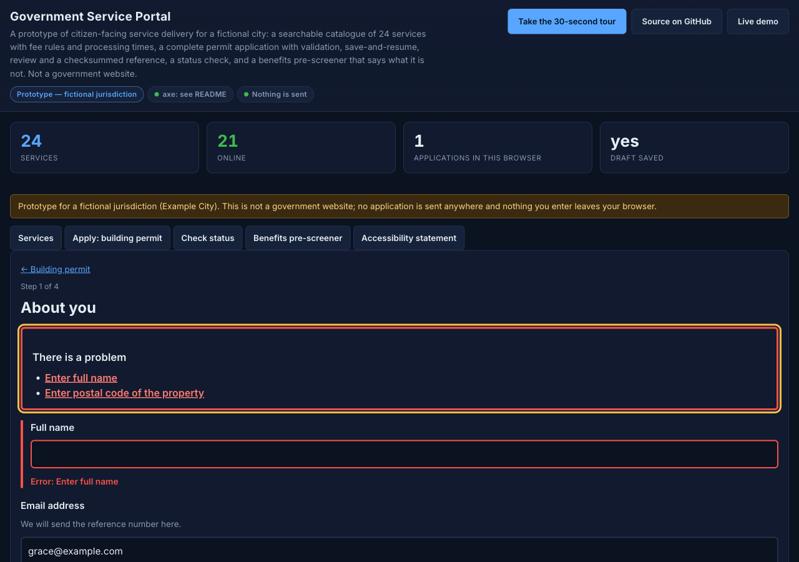
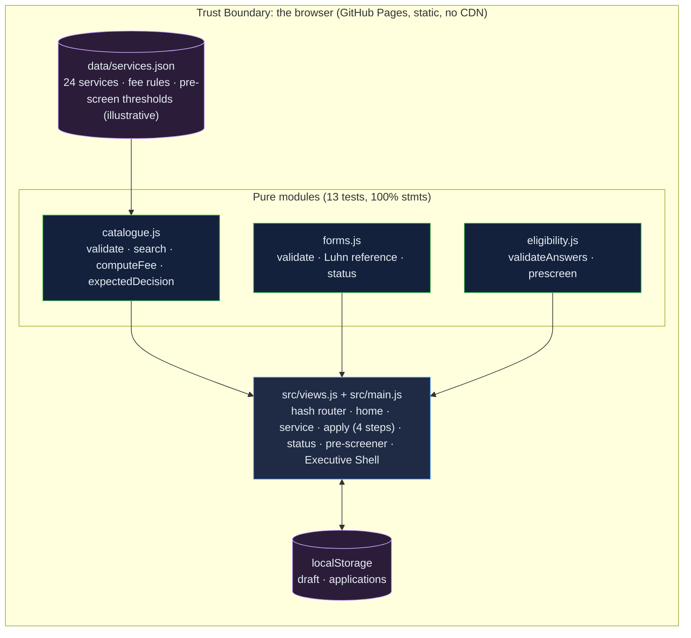

# Government Service Portal: a service-delivery prototype that computes its fees, validates its forms, and says what it is not

[](https://github.com/Freddricklogan/Government-Service-Portal/actions/workflows/deploy.yml)
[](#5-getting-started--verification)
[](https://github.com/Freddricklogan/Government-Service-Portal/actions/workflows/codeql.yml)
[](LICENSE)
[](https://freddricklogan.github.io/Government-Service-Portal/)

## 1. Executive Summary & Business Impact

**Problem statement.** Public-sector "digital service" prototypes tend
to be landing pages: a banner that looks official, six cards, nineteen
links to `#`, and documents that assert compliance and cite research.
The previous version of this repository was that, including a
compliance table with every WCAG row marked "Pass" and a research
report describing 1,200 survey respondents who did not exist
(`AUDIT.md`).

**Solution & value delivered.** A working prototype for a fictional
city that is honest about being one. A catalogue of 24 services with
fee rules, processing times and required documents, validated on load
and searched with a ranked matcher. A complete building-permit
application: four steps with required, format, range, real-date and
conditional rules, an error summary that lists problems in order and
links to each field, `aria-invalid` and `aria-describedby` on every
input, save-and-resume, a check-your-answers page, and a reference
number with a Luhn check digit. A status check that rejects mistyped
references before looking them up. A benefits pre-screener that gives
the reason for every "unlikely" and states on the page that it is not a
determination. An accessibility statement that reports what axe-core
actually measured — 0 violations across seven routes — and what was
not tested.

**[→ Read the full case study](docs/CASE_STUDY.md)**



## 2. Demonstrated Competencies & Technical Skills

- **Public-Sector Service Design** — USWDS and GOV.UK form patterns
  (error summary, hint text, check-your-answers, save-and-return,
  readable reference numbers), fee and timeline rules as data, a
  pre-screener that knows its limits.
- **Accessibility** — measured with axe-core 4.13.0 on seven routes
  including error states; hand-computed contrast for every palette
  pair; keyboard focus management; native controls only; a statement
  that lists what was not tested.
- **Security** — `default-src 'none'; script-src 'self'` with no
  external scripts, no `innerHTML`, user input never reaches markup,
  nothing transmitted.
- **Engineering Practice** — three pure modules at 100 % statement
  coverage; a real-date bug (`Date.parse('2026-02-30')` rolls forward
  in V8) caught by a test and fixed; fabricated documents replaced by
  measured ones.

## 3. System Architecture & Data Flow



No backend, no account, no telemetry, no external script. Applications
exist only in the browser that created them, and the page says so.

## 4. Technical Highlights & Engineering Decisions

### ADR-1 — Rules live in the catalogue, not in the page

**Context.** The old page described services; nothing computed a fee
or a date.

**Decision.** Each service carries a fee rule (flat, per unit with a
minimum, or tiered), processing days and required documents.
`computeFee` and `expectedDecision` (business days) are the only places
those are interpreted, and the catalogue is validated on load.

**Consequence.** The service page, the review page and the
confirmation cannot disagree, and a policy change is a data edit with
a test.

### ADR-2 — Validation as a schema with an ordered error summary

**Context.** Government form guidance is specific: list errors in
order, link each to its field, say what to do, mark invalid fields for
assistive technology.

**Decision.** `validate(schema, values)` returns errors in schema order
with messages in the "Enter …" / "… must be …" pattern; the view
renders the summary with `role="alert"`, moves focus to it, links to
fields, and sets `aria-invalid` and `aria-describedby`. Conditional
fields use `when` and are removed from the tree with `hidden`.

**Consequence.** Every rule is tested without a DOM, including the
real-date round trip that caught 30 February being accepted.

### ADR-3 — Replace claims with measurements

**Context.** The repository asserted WCAG conformance and research
findings it could not support.

**Decision.** The accessibility document reports axe-core results per
route (0 violations, 38–42 rules passed, two nodes axe could not
resolve and their hand-computed ratios), keyboard checks, and an
explicit "not tested" list. The research document opens by saying the
previous figures were invented and offers rationale and illustrative
personas instead.

**Consequence.** A reader can reproduce every number in both
documents, and the prototype's badge says "axe: see README" rather than
"WCAG AA".

## 5. Getting Started & Verification

**Prerequisites.** Node 22 LTS. No build step; the page is served from
the repository root.

```bash
git clone https://github.com/Freddricklogan/Government-Service-Portal.git
cd Government-Service-Portal
npm ci
npm run lint && npm run validate && npm run coverage
npx serve .    # open http://localhost:3000
```

**Verification — the numbers this repository actually produced:**

```bash
npm run coverage   # 13 passed / 13; All files 100% stmts, 93.86% branches
npm run lint       # 0 problems
npm run validate   # html-validate index.html: clean
```

| Check | Result |
| --- | --- |
| Unit tests (Vitest) | **13 passed / 13** across 3 files |
| Coverage (pure modules) | **100%** statements, **93.86%** branches (`views.js`, `main.js`, `ui.js` covered by the browser smoke test) |
| ESLint, html-validate | clean |
| Catalogue | 24 services, 6 categories, validator reports 0 problems |
| axe-core 4.13.0 (headless Chromium, tags wcag2a/2aa/21a/21aa/best-practice) | **0 violations** on 7 routes incl. two error states; 38–42 rules passed per route; 2 nodes "incomplete" on a gradient, contrast computed by hand (14.7:1, 5.96:1); lowest palette pair 5.17:1 |
| Headless Chrome smoke | **0 console errors**; search "deck" → building permit; fee $300 at $25,000 and $1,200 at $100,000; step 1 empty submit → 3 errors in order, focus on summary, summary link focuses field; owner-builder hides contractor field; review lists 9 answers + fee $144; submit → reference `EC-2026-NNNNNN-C`; bad check digit rejected; status "Received"; pre-screener 3 likely at $2,500 for 3, 3 unlikely with limits at $9,000; draft saved and restored; four tour steps; no horizontal scroll at 1280 or 400 px on all 7 routes |

## 6. Live Demo & Production Showcase

**<https://freddricklogan.github.io/Government-Service-Portal/>**

**30-second guided walkthrough.** Press **Take the 30-second tour**: it
searches by keyword, opens the application with its error pattern,
shows the status check, and ends on the pre-screener. Then apply for a
building permit end to end; the reference number stays in your browser.
